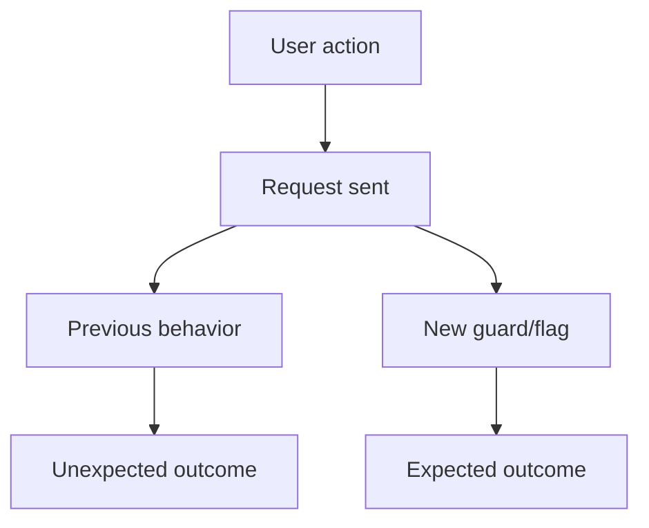

# Create Pull Request (Generic)

## Purpose
Provide a deterministic, stack-agnostic workflow for creating a GitHub pull request via the GitHub CLI (`gh`) for any application, language, or framework.

## When to Use
- The user asks to create, open, submit, or raise a pull request.
- The user says "create PR", "open PR", "submit PR", or similar.
- A feature/fix is complete and ready to push and open a PR.

## Prerequisites
- `git` and `gh` are installed and authenticated (`gh auth status`).
- Repository has a remote named `origin` on GitHub.
- Determine the **default branch** dynamically — never hardcode `master` or `main`:
  ```bash
  DEFAULT_BRANCH=$(gh repo view --json defaultBranchRef -q .defaultBranchRef.name)
  ```
  Fallback if `gh` is unavailable:
  ```bash
  DEFAULT_BRANCH=$(git symbolic-ref refs/remotes/origin/HEAD | sed 's@^refs/remotes/origin/@@')
  ```

## Workflow
Execute all steps automatically. Stop only on the conditions in **Guardrails**.

### 1. Create a Clean Branch
Always branch from the **latest default branch**, regardless of current branch.

1. `git fetch origin`
2. Check pending changes: `git status --porcelain`
3. If pending, stash including untracked: `git stash push -u -m "create-pr temp stash"`
4. Switch and update:
   ```bash
   git checkout "$DEFAULT_BRANCH"
   git pull origin "$DEFAULT_BRANCH"
   ```
5. Create branch using convention:
   - `feature/<short-description>` — features
   - `fix/<short-description>` — bug fixes
   - `chore/<short-description>` — maintenance
   - `refactor/<…>`, `docs/<…>`, `test/<…>` as appropriate
   ```bash
   git checkout -b <branch-name>
   ```
6. If stashed, restore: `git stash pop`
7. On `stash pop` conflicts, **stop and request user intervention**.

### 2. Stage and Commit
- Stage **only** files related to the change. Never use `git add .` or `git add -A`.
- Use explicit paths: `git add <file1> <file2> ...`
- Exclude unrelated edits (local config, editor settings, agent/instruction files unless intentional).
- Verify staged set: `git diff --cached --stat`
- If no relevant changes, **stop and inform the user**.

Use **conventional commits** with multi-line message:
- Subject: `<type>: <concise summary>` — max 72 chars.
- Blank line.
- Body: explain **what** and **why**, grouped by area; one bullet per significant change.

Allowed types: `feat`, `fix`, `refactor`, `test`, `chore`, `docs`, `style`, `perf`, `ci`, `build`.

Cross-platform safe commit (avoids shell-quoting issues):
```bash
COMMIT_MSG_FILE=$(mktemp)
cat > "$COMMIT_MSG_FILE" <<'EOF'
<type>: <concise summary>

- <what changed and why, bullet 1>
- <bullet 2>
- <bullet 3>
EOF
git commit -F "$COMMIT_MSG_FILE"
rm -f "$COMMIT_MSG_FILE"
```

### 3. Push Branch
```bash
git push --set-upstream origin <branch-name>
```
On rejection or failure, **stop and request user intervention**.

### 4. Validate (Stack-Agnostic)
Detect from repository signals — do not assume a stack. Run only what applies and prefer scoped/affected tests.

| Signal file               | Suggested command                                                |
|---------------------------|------------------------------------------------------------------|
| `package.json`            | `npm test` (prefer scoped: `npx jest <files>`, `npx vitest run <files>`, `npx ng test --include=...`) |
| `pom.xml`                 | `mvn -q -pl <module> test -Dtest=<ChangedTests>`                 |
| `build.gradle[.kts]`      | `./gradlew test --tests <ChangedTests>`                          |
| `pyproject.toml` / `setup.py` | `pytest <changed_paths>` or `python -m unittest <module>`    |
| `*.csproj` / `*.sln`      | `dotnet test --filter <ChangedTests>`                            |
| `go.mod`                  | `go test ./<changed_pkgs>/...`                                   |
| `Cargo.toml`              | `cargo test <changed_modules>`                                   |
| `Makefile`                | `make test` (use a scoped target if available)                   |

Rules:
- If validation fails, **stop and fix**. Re-stage, amend (`git commit --amend --no-edit`), continue.
- If no test infrastructure is detected, skip this step.

### 5. Analyze Changes
```bash
git log "origin/$DEFAULT_BRANCH..HEAD" --oneline
git diff "origin/$DEFAULT_BRANCH..HEAD" --stat
git diff "origin/$DEFAULT_BRANCH..HEAD"
```
Determine: main purpose, change type, affected areas (modules, services, components, configs, tests).

### 5.1 Optional Static Analysis
If a SonarQube/SonarLint or similar IDE tool is available, analyze each modified non-test file. Fix issues on lines you modified, then amend and `git push --force-with-lease`. Skip silently if unavailable — do not block PR on it.

### 6. Generate PR Title
- Format: `<type>: <concise description>`
- Under 72 characters; specific, not generic.
- Examples:
  - `fix: correct null check in payment validator`
  - `feat: add station filter to flight search`
  - `refactor: extract retry logic into shared helper`

### 7. Generate PR Description
Use this concise, professional template — no filler:

```markdown
## Problem
What was happening or what was needed.

## Solution
What was implemented or changed.

## Impact
Affected areas: modules, services, components, configs, or shared code.

## Testing
How the changes were validated (commands run, suites executed, manual checks).
```

### 7.1 Optional Mermaid Diagram
Include only when it materially improves clarity (non-trivial flow, new branching). Place after `## Solution`, before `## Impact`. Always include if the user explicitly requests it.

````markdown
## Diagram


````

### 8. Create the PR
Always use `--body-file` with a temp file — never inline `--body` (avoids shell-quoting issues across bash/zsh/PowerShell).

bash/zsh (macOS/Linux):
```bash
PR_BODY_FILE=$(mktemp)
cat > "$PR_BODY_FILE" <<'EOF'
## Problem
...

## Solution
...

## Impact
...

## Testing
...
EOF

gh pr create \
  --base "$DEFAULT_BRANCH" \
  --title "<type>: <concise description>" \
  --body-file "$PR_BODY_FILE"

rm -f "$PR_BODY_FILE"
```

PowerShell (Windows):
```powershell
$prBody = @'
## Problem
...

## Solution
...

## Impact
...

## Testing
...
'@
$tmp = Join-Path $env:TEMP "pr-body.md"
$prBody | Out-File -Encoding utf8 $tmp
gh pr create --base $env:DEFAULT_BRANCH --title "<title>" --body-file $tmp
Remove-Item $tmp -ErrorAction SilentlyContinue
```

Display the resulting PR URL to the user.

## Guardrails
Stop and request user intervention if:
- Merge/stash conflicts occur during `stash pop` or any git operation.
- `git push` is rejected (non-fast-forward, protected branch, auth failure).
- `gh` is not authenticated or default branch cannot be determined.
- No relevant changes are detected after staging.
- Validation (tests/lint) fails and the cause is unclear.
- Any git command returns an unexpected error.

## Cross-Platform Notes
- On PowerShell, `git` writes informational output to stderr, sometimes producing exit code 1 on success. Verify success by inspecting output, not exit code alone.
- Use `;` to chain commands in PowerShell; use `&&` in bash/zsh.
- Always use `--body-file` for `gh pr create` to avoid shell-escaping problems with markdown, backticks, and code fences.
- Use `git push --force-with-lease` (never `--force`) when amending a pushed commit.

## Output Expectations
- Branch name created and base default branch.
- Commit subject and bullet body.
- Validation commands executed and result.
- Final PR URL.
