# Mermaid Diagram Guide for Technical Documentation

A focused reference for the Mermaid diagram types used in the `tech-doc-generator` skill. Covers the five diagram types needed: flowcharts (architecture, process flows, integrations), sequence diagrams, ER diagrams, state diagrams, and C4.

> **Full Mermaid reference**: For advanced syntax, see the [official Mermaid documentation](https://mermaid.js.org/intro/).

---

## Table of Contents

- [Flowcharts](#flowcharts)
- [Sequence Diagrams](#sequence-diagrams)
- [ER Diagrams](#er-diagrams)
- [State Diagrams](#state-diagrams)
- [C4 Diagrams](#c4-diagrams)
- [Styling & Theming](#styling--theming)
- [Validation Rules](#validation-rules)
- [Common Errors & Fixes](#common-errors--fixes)

---

## Flowcharts

Used for **architecture diagrams**, **process flows**, and **integration maps**.

### Basic Syntax

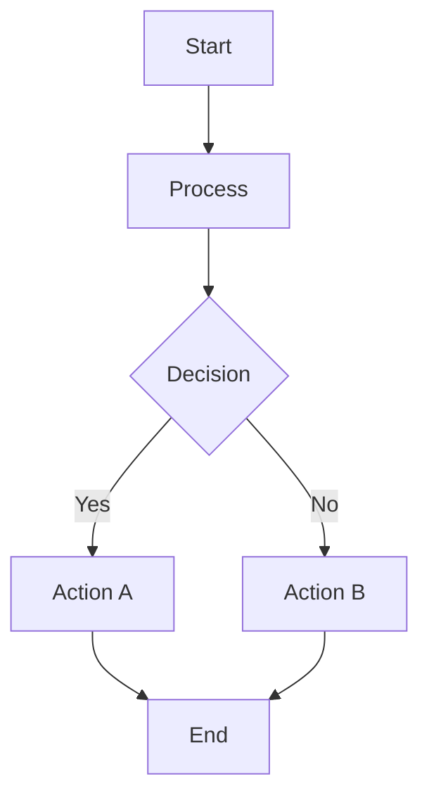
```mermaid
flowchart TD
    A["Start"] --> B["Process"]
    B --> C{"Decision"}
    C -->|"Yes"| D["Action A"]
    C -->|"No"| E["Action B"]
    D --> F["End"]
    E --> F
```

### Direction

| Code | Direction |
|------|-----------|
| `TD` or `TB` | Top to bottom |
| `BT` | Bottom to top |
| `LR` | Left to right |
| `RL` | Right to left |

**Recommendations**:
- `TD` for architecture and process flows (hierarchical)
- `LR` for integration maps (horizontal flow)

### Node Shapes

| Syntax | Shape | Use For |
|--------|-------|---------|
| `A["text"]` | Rectangle | Services, components, generic steps |
| `A("text")` | Rounded rectangle | Start/end points, user actions |
| `A{"text"}` | Diamond | Decisions, conditionals |
| `A[("text")]` | Cylinder | Databases, data stores |
| `A(["text"])` | Stadium | Queues, buffers |
| `A[/"text"/]` | Parallelogram | Input/output, external data |
| `A(("text"))` | Circle | Events, triggers |
| `A[["text"]]` | Subroutine | Sub-processes, external calls |
| `A>"text"]` | Flag | Async signals |

### Arrow Types

| Syntax | Meaning | Use For |
|--------|---------|---------|
| `-->` | Solid arrow | Synchronous calls |
| `-.->` | Dotted arrow | Asynchronous calls |
| `==>` | Thick arrow | Primary/critical path |
| `-->\|"label"\|` | Labeled arrow | Protocol, method, condition |
| `--x` | Cross end | Failure/blocked path |
| `--o` | Circle end | Event emission |

### Subgraphs

Use subgraphs to represent **architectural boundaries**: layers, services, external systems, network zones.

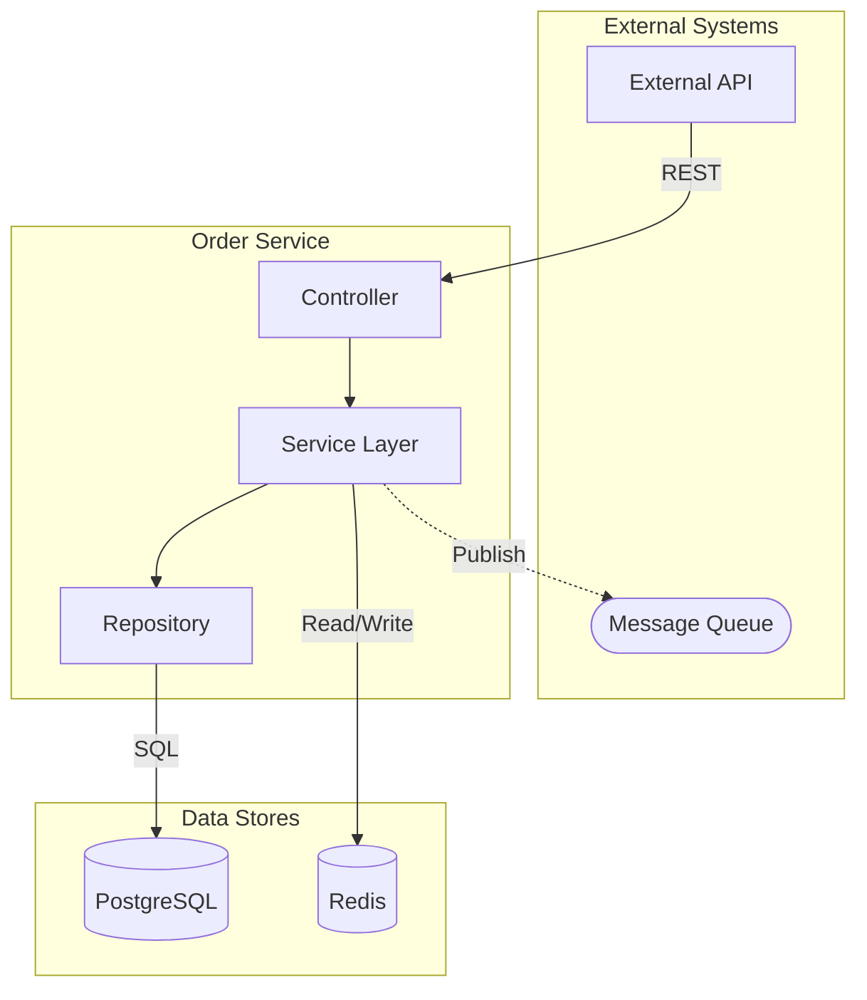
```mermaid
flowchart TD
    subgraph External["External Systems"]
        API["External API"]
        Queue(["Message Queue"])
    end

    subgraph Service["Order Service"]
        Controller["Controller"]
        Logic["Service Layer"]
        Repo["Repository"]
    end

    subgraph Data["Data Stores"]
        DB[("PostgreSQL")]
        Cache[("Redis")]
    end

    API -->|"REST"| Controller
    Controller --> Logic
    Logic --> Repo
    Repo -->|"SQL"| DB
    Logic -->|"Read/Write"| Cache
    Logic -.->|"Publish"| Queue
```

### Architecture Diagram Pattern

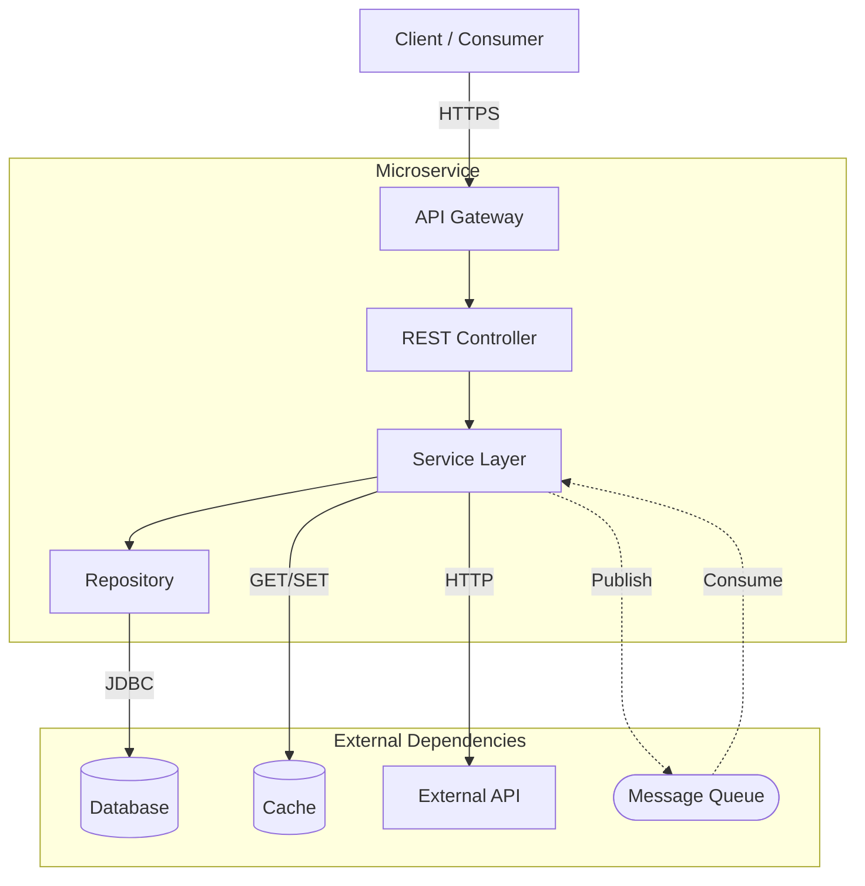
```mermaid
flowchart TD
    Client["Client / Consumer"] -->|"HTTPS"| Gateway["API Gateway"]

    subgraph Service["Microservice"]
        Gateway --> Controller["REST Controller"]
        Controller --> ServiceLayer["Service Layer"]
        ServiceLayer --> Repository["Repository"]
    end

    subgraph External["External Dependencies"]
        DB[("Database")]
        Cache[("Cache")]
        ExtAPI["External API"]
        Queue(["Message Queue"])
    end

    Repository -->|"JDBC"| DB
    ServiceLayer -->|"GET/SET"| Cache
    ServiceLayer -->|"HTTP"| ExtAPI
    ServiceLayer -.->|"Publish"| Queue
    Queue -.->|"Consume"| ServiceLayer
```

### Process Flow Pattern

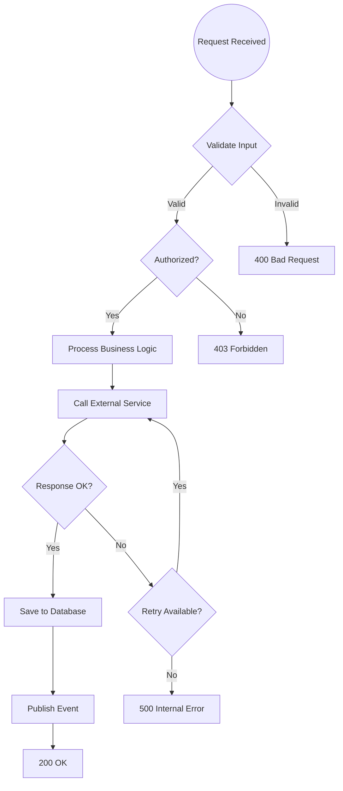
```mermaid
flowchart TD
    Start(("Request Received")) --> Validate{"Validate Input"}
    Validate -->|"Valid"| Auth{"Authorized?"}
    Validate -->|"Invalid"| Error400["400 Bad Request"]
    Auth -->|"Yes"| Process["Process Business Logic"]
    Auth -->|"No"| Error403["403 Forbidden"]
    Process --> ExtCall["Call External Service"]
    ExtCall --> CheckResp{"Response OK?"}
    CheckResp -->|"Yes"| Save["Save to Database"]
    CheckResp -->|"No"| Retry{"Retry Available?"}
    Retry -->|"Yes"| ExtCall
    Retry -->|"No"| Error500["500 Internal Error"]
    Save --> Publish["Publish Event"]
    Publish --> Success["200 OK"]
```

---

## Sequence Diagrams

Used for **request path documentation** showing time-ordered interactions between components.

### Basic Syntax

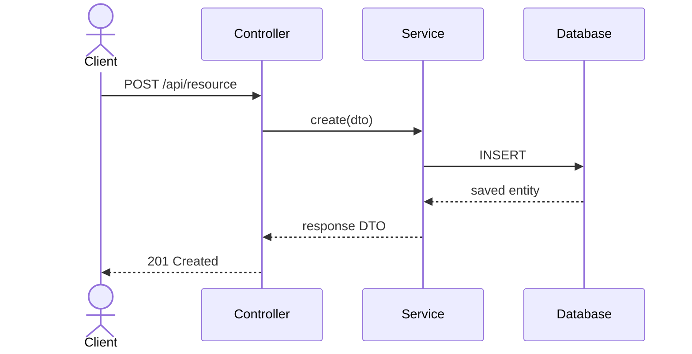
```mermaid
sequenceDiagram
    actor Client
    participant Controller
    participant Service
    participant DB as Database

    Client->>Controller: POST /api/resource
    Controller->>Service: create(dto)
    Service->>DB: INSERT
    DB-->>Service: saved entity
    Service-->>Controller: response DTO
    Controller-->>Client: 201 Created
```

### Arrow Types

| Syntax | Meaning | Use For |
|--------|---------|---------|
| `->>` | Solid line, arrow | Synchronous request |
| `-->>` | Dotted line, arrow | Response / return |
| `--)` | Solid line, open arrow | Async message (fire-and-forget) |
| `-x` | Solid line, cross | Failed call |

### Participants

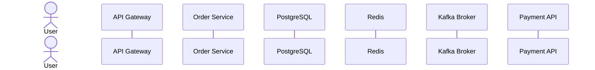
```mermaid
sequenceDiagram
    actor User
    participant GW as API Gateway
    participant Svc as Order Service
    participant DB as PostgreSQL
    participant Cache as Redis
    participant Kafka as Kafka Broker
    participant Ext as Payment API
```

- Use `actor` for external users/systems
- Use `participant` for internal components
- Use `as` for display aliases

### Conditional Blocks (alt/opt/loop)

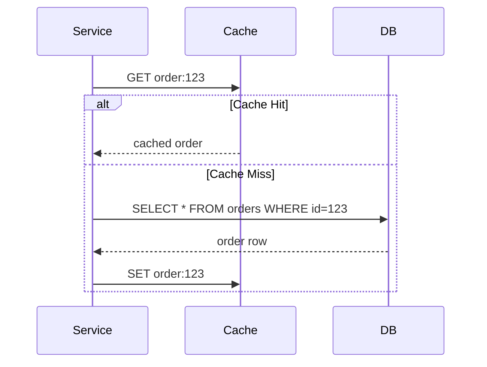
```mermaid
sequenceDiagram
    participant Service
    participant Cache
    participant DB

    Service->>Cache: GET order:123
    alt Cache Hit
        Cache-->>Service: cached order
    else Cache Miss
        Service->>DB: SELECT * FROM orders WHERE id=123
        DB-->>Service: order row
        Service->>Cache: SET order:123
    end
```

### Loops and Optional Blocks

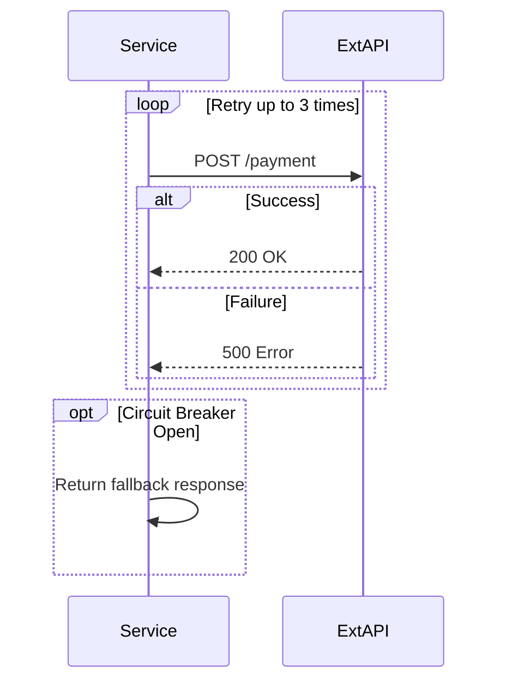
```mermaid
sequenceDiagram
    participant Service
    participant ExtAPI

    loop Retry up to 3 times
        Service->>ExtAPI: POST /payment
        alt Success
            ExtAPI-->>Service: 200 OK
        else Failure
            ExtAPI-->>Service: 500 Error
        end
    end

    opt Circuit Breaker Open
        Service->>Service: Return fallback response
    end
```

### Notes

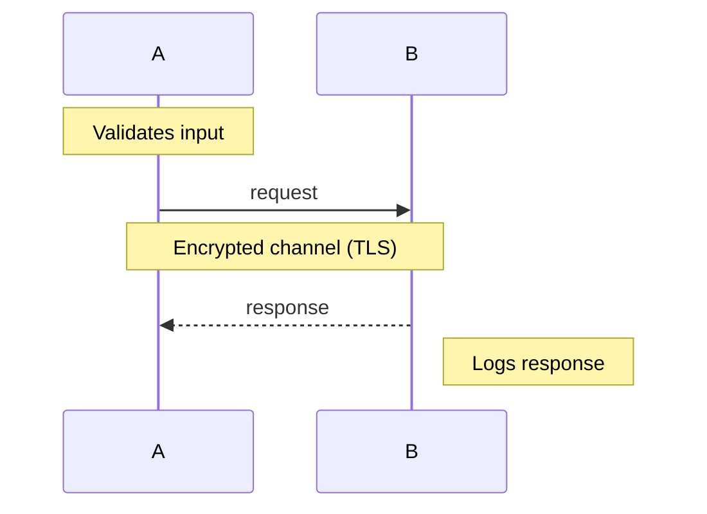
```mermaid
sequenceDiagram
    participant A
    participant B
    Note over A: Validates input
    A->>B: request
    Note over A,B: Encrypted channel (TLS)
    B-->>A: response
    Note right of B: Logs response
```

### Activation / Deactivation

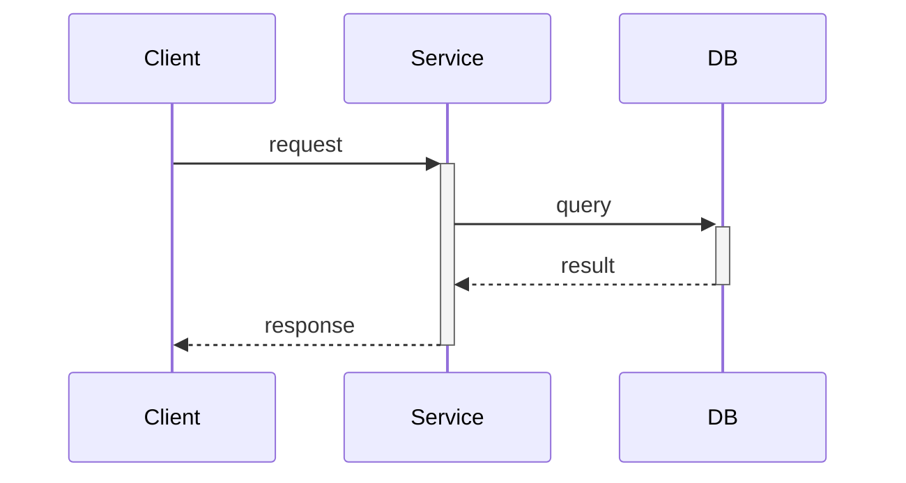
```mermaid
sequenceDiagram
    participant Client
    participant Service
    
    Client->>+Service: request
    Service->>+DB: query
    DB-->>-Service: result
    Service-->>-Client: response
```

Use `+` after `>>` to activate (show processing bar), `-` to deactivate.

---

## ER Diagrams

Used for **data model documentation** showing entity relationships.

### Basic Syntax

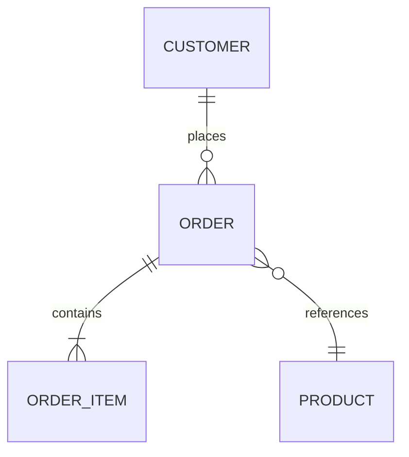
```mermaid
erDiagram
    CUSTOMER ||--o{ ORDER : places
    ORDER ||--|{ ORDER_ITEM : contains
    ORDER }o--|| PRODUCT : references
```

### Relationship Types

| Syntax | Meaning |
|--------|---------|
| `\|\|--\|\|` | One to one |
| `\|\|--o{` | One to zero-or-many |
| `\|\|--\|{` | One to one-or-many |
| `}o--o{` | Zero-or-many to zero-or-many |

### Entities with Attributes

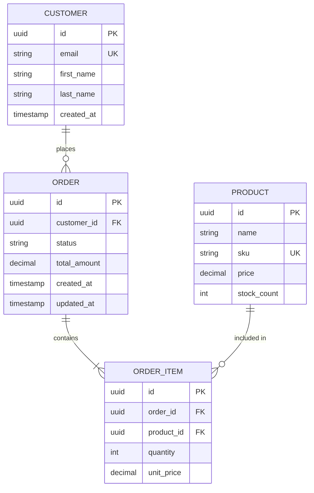
```mermaid
erDiagram
    CUSTOMER {
        uuid id PK
        string email UK
        string first_name
        string last_name
        timestamp created_at
    }
    ORDER {
        uuid id PK
        uuid customer_id FK
        string status
        decimal total_amount
        timestamp created_at
        timestamp updated_at
    }
    ORDER_ITEM {
        uuid id PK
        uuid order_id FK
        uuid product_id FK
        int quantity
        decimal unit_price
    }
    PRODUCT {
        uuid id PK
        string name
        string sku UK
        decimal price
        int stock_count
    }

    CUSTOMER ||--o{ ORDER : places
    ORDER ||--|{ ORDER_ITEM : contains
    PRODUCT ||--o{ ORDER_ITEM : "included in"
```

### Attribute Markers

| Marker | Meaning |
|--------|---------|
| `PK` | Primary key |
| `FK` | Foreign key |
| `UK` | Unique key |

---

## State Diagrams

Used for **state machines** and **status transitions** in business rules documentation.

### Basic Syntax

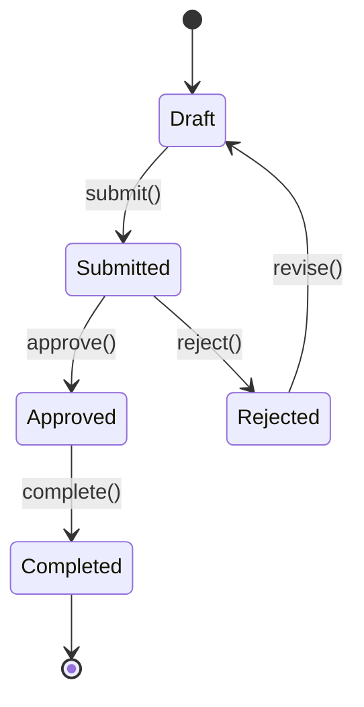
```mermaid
stateDiagram-v2
    [*] --> Draft
    Draft --> Submitted : submit()
    Submitted --> Approved : approve()
    Submitted --> Rejected : reject()
    Approved --> Completed : complete()
    Rejected --> Draft : revise()
    Completed --> [*]
```

### Composite States

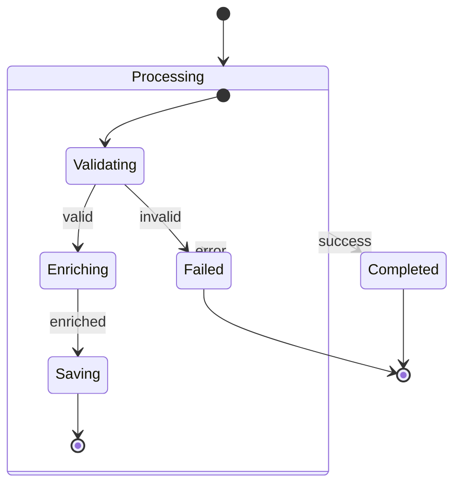
```mermaid
stateDiagram-v2
    [*] --> Processing

    state Processing {
        [*] --> Validating
        Validating --> Enriching : valid
        Validating --> Failed : invalid
        Enriching --> Saving : enriched
        Saving --> [*]
    }

    Processing --> Completed : success
    Processing --> Failed : error
    Failed --> [*]
    Completed --> [*]
```

---

## C4 Diagrams

Used for **system context** and **container-level** architecture views.

### C4 Context Diagram

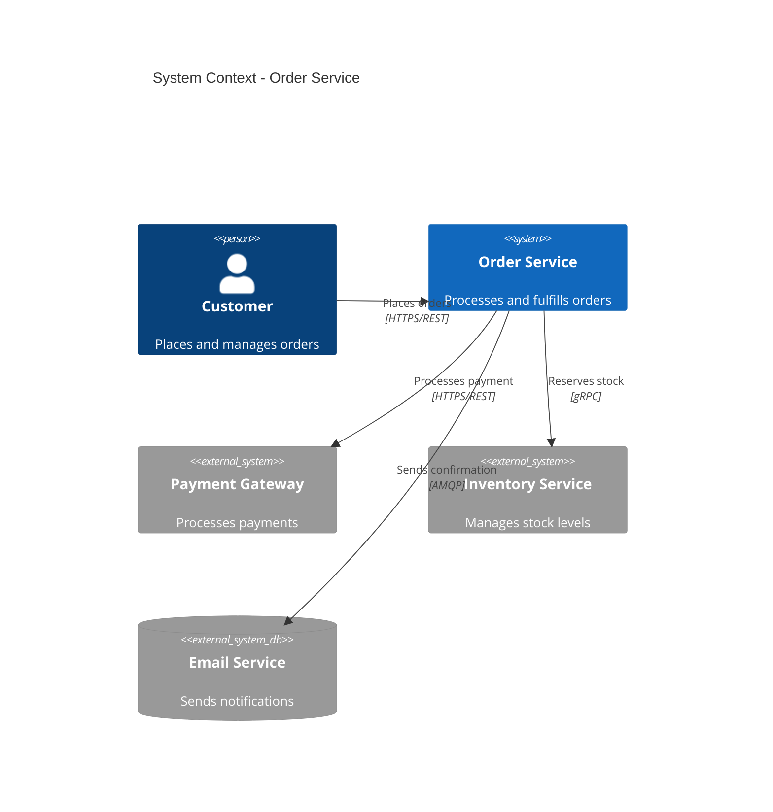
```mermaid
C4Context
    title System Context - Order Service

    Person(customer, "Customer", "Places and manages orders")
    System(orderService, "Order Service", "Processes and fulfills orders")
    System_Ext(paymentGw, "Payment Gateway", "Processes payments")
    System_Ext(inventorySvc, "Inventory Service", "Manages stock levels")
    SystemDb_Ext(emailSvc, "Email Service", "Sends notifications")

    Rel(customer, orderService, "Places orders", "HTTPS/REST")
    Rel(orderService, paymentGw, "Processes payment", "HTTPS/REST")
    Rel(orderService, inventorySvc, "Reserves stock", "gRPC")
    Rel(orderService, emailSvc, "Sends confirmation", "AMQP")
```

### C4 Container Diagram

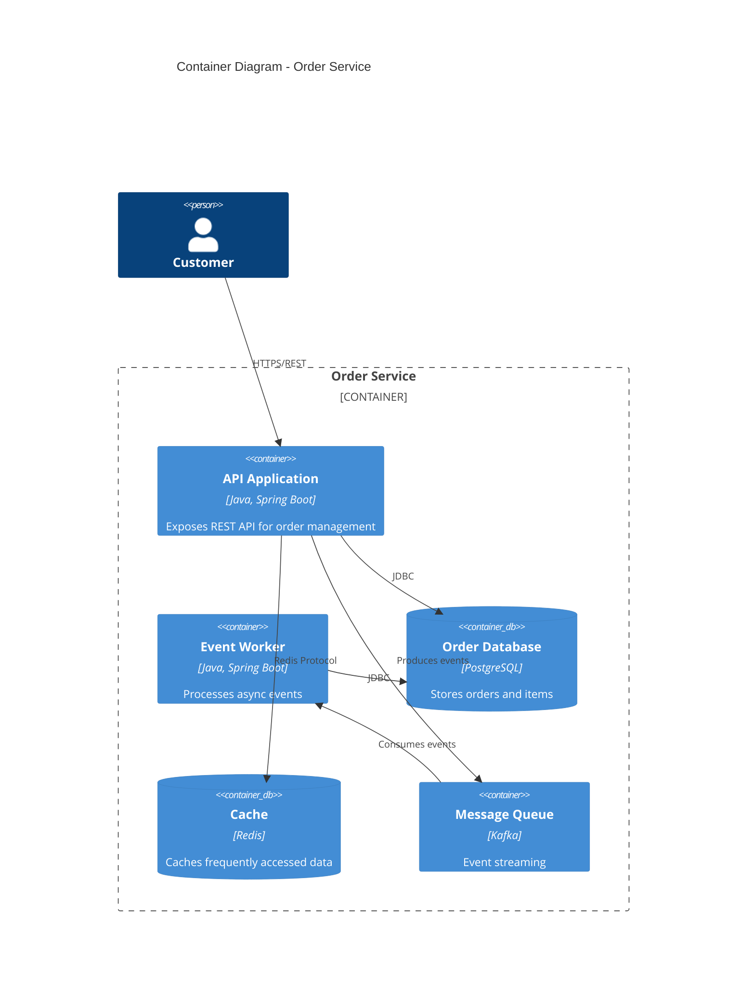
```mermaid
C4Container
    title Container Diagram - Order Service

    Person(customer, "Customer")

    Container_Boundary(orderBoundary, "Order Service") {
        Container(api, "API Application", "Java, Spring Boot", "Exposes REST API for order management")
        Container(worker, "Event Worker", "Java, Spring Boot", "Processes async events")
        ContainerDb(db, "Order Database", "PostgreSQL", "Stores orders and items")
        ContainerDb(cache, "Cache", "Redis", "Caches frequently accessed data")
        Container(queue, "Message Queue", "Kafka", "Event streaming")
    }

    Rel(customer, api, "HTTPS/REST")
    Rel(api, db, "JDBC")
    Rel(api, cache, "Redis Protocol")
    Rel(api, queue, "Produces events")
    Rel(queue, worker, "Consumes events")
    Rel(worker, db, "JDBC")
```

---

## Styling & Theming

### Class Definitions

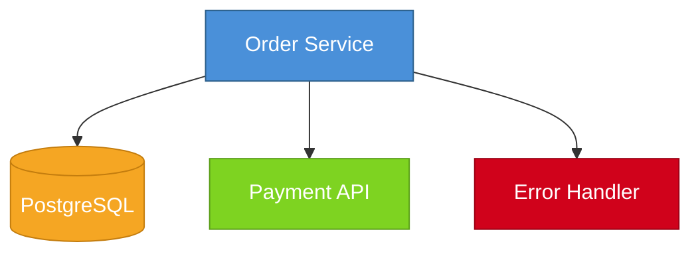
```mermaid
flowchart TD
    classDef service fill:#4a90d9,stroke:#2c5f8a,color:#fff
    classDef database fill:#f5a623,stroke:#c47d0e,color:#fff
    classDef external fill:#7ed321,stroke:#5a9e18,color:#fff
    classDef error fill:#d0021b,stroke:#9b0114,color:#fff

    A["Order Service"]:::service --> B[("PostgreSQL")]:::database
    A --> C["Payment API"]:::external
    A --> D["Error Handler"]:::error
```

### Recommended Color Scheme

| Component Type | Fill | Stroke | Use For |
|---------------|------|--------|---------|
| Internal Service | `#4a90d9` | `#2c5f8a` | Your microservice components |
| Database | `#f5a623` | `#c47d0e` | Data stores (SQL, NoSQL) |
| External System | `#7ed321` | `#5a9e18` | Third-party APIs, external services |
| Cache | `#bd10e0` | `#8a0ca5` | Redis, Memcached, in-memory |
| Queue | `#50e3c2` | `#3aab91` | Kafka, RabbitMQ, SQS |
| Error/Warning | `#d0021b` | `#9b0114` | Error paths, failure states |
| User/Actor | `#9b9b9b` | `#6b6b6b` | External users, clients |

---

## Validation Rules

**MANDATORY**: Every diagram MUST be validated before inclusion in documentation.

### Pre-Validation Checklist

- [ ] Diagram type keyword is correct (`flowchart`, `sequenceDiagram`, `erDiagram`, `stateDiagram-v2`, `C4Context`, `C4Container`)
- [ ] All `subgraph` blocks have matching `end` keywords
- [ ] Node IDs use only letters, numbers, and underscores (no spaces, hyphens, or special characters)
- [ ] All parentheses, brackets, and braces are balanced
- [ ] Arrow syntax matches the diagram type (don't mix flowchart arrows in sequence diagrams)
- [ ] String literals with special characters are wrapped in double quotes
- [ ] No reserved Mermaid keywords used as node IDs
- [ ] Labels with special characters are properly quoted
- [ ] Max ~15 nodes per diagram (split if more)

### Validation Workflow

1. Generate diagram code
2. Run `mermaid-diagram-validator` on the code
3. If errors → fix and re-validate
4. Run `mermaid-diagram-preview` to verify visual rendering
5. If rendering issues → fix and repeat from step 2
6. Only then include in documentation

---

## Common Errors & Fixes

| Error | Cause | Fix |
|-------|-------|-----|
| `Parse error on line X` | Invalid syntax | Check arrow types, node shapes, and keywords |
| `Duplicate node id` | Same ID used twice | Use unique IDs: `DB1`, `DB2` instead of `DB`, `DB` |
| `Unclosed subgraph` | Missing `end` | Ensure every `subgraph` has a matching `end` |
| `Invalid characters in ID` | Spaces/hyphens in node ID | Use `OrderService` not `Order-Service` or `Order Service` |
| `Unknown diagram type` | Typo in diagram keyword | Check: `flowchart`, `sequenceDiagram`, `erDiagram` |
| `Unexpected token` | Missing quotes on labels | Wrap labels in double quotes: `A["My Label"]` |
| Arrows not rendering | Wrong arrow syntax for diagram type | Flowcharts: `-->`, Sequence: `->>` |
| Subgraph title not showing | Missing title after `subgraph` | `subgraph Title["Display Name"]` |
| ER relationship error | Wrong cardinality syntax | Use `\|\|--o{` not `1--*` |

### Reserved Words (Cannot Use as Node IDs)

`end`, `subgraph`, `click`, `style`, `classDef`, `class`, `linkStyle`, `graph`, `flowchart`, `sequenceDiagram`, `erDiagram`, `stateDiagram`

---

## Tips for Documentation Diagrams

1. **Keep diagrams focused** — One concern per diagram. Don't mix architecture with data flow.
2. **Label everything** — Every arrow should have a label (protocol, method, or data).
3. **Use subgraphs for boundaries** — Clearly separate internal vs external, layers, domains.
4. **Consistent naming** — PascalCase for components, lowercase for labels.
5. **Direction matters** — `TD` for hierarchies, `LR` for flows and integration maps.
6. **Split large diagrams** — If you have more than ~15 nodes, break into multiple diagrams.
7. **Color-code by type** — Use the recommended color scheme for quick visual parsing.
8. **Show both paths** — Include success and error/fallback paths in process flows and sequences.
